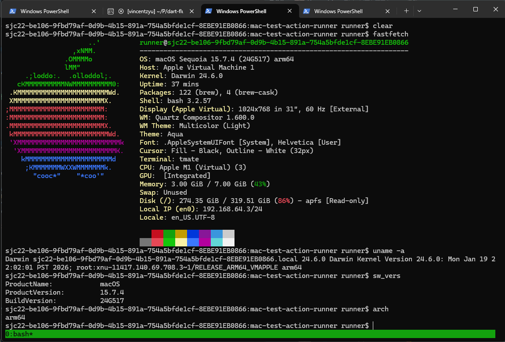
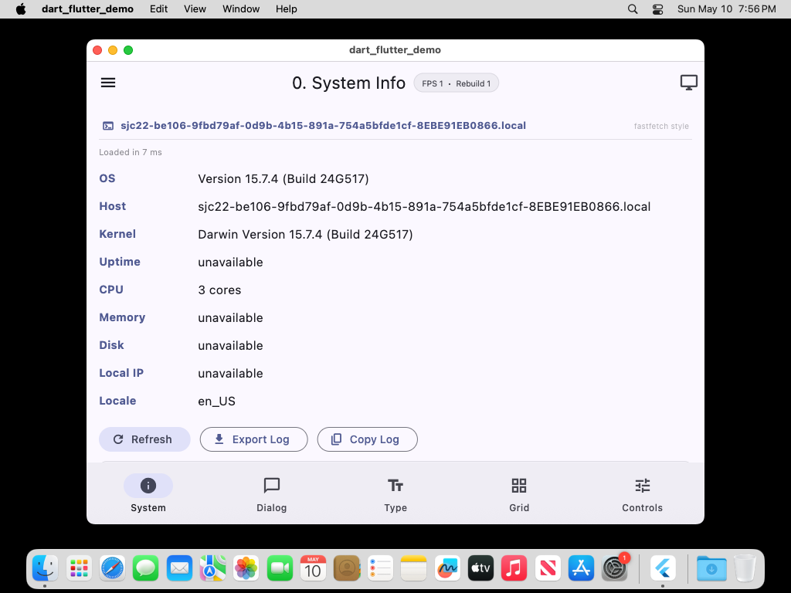

# mac-test-action-runner

GitHub Actions workflow for temporary SSH sessions on macOS runners, with support for downloading and testing different projects.

## Usage

Push a commit containing a specific keyword to the main branch:

### 1. Empty macOS SSH (no binary download)

```bash
git commit --allow-empty -m "start-empty"
git push
```

### 2. Download and test winload

```bash
git commit --allow-empty -m "start-winload"
git push
```

- Automatically downloads the latest [winload](https://github.com/VincentZyuApps/winload) macOS binary
- Auto-detects architecture (x86_64 / arm64)
- Runs `./winload --help` after download

### 3. Download and test dart-flutter-demo

| Commit message | Download | Launch | Screenshot | Artifact | Release |
|---|---|---|---|---|---|
| `start-dart-flutter-demo` | ✅ | ✅ | ✅ | ❌ | ❌ |
| `start-dart-flutter-demo --artifact-pic` | ✅ | ✅ | ✅ | ✅ | ❌ |
| `start-dart-flutter-demo --release-pic` | ✅ | ✅ | ✅ | ✅ | ✅ (inline) |

> `--release-pic` includes `--artifact-pic`. Release tag format: `screenshot-YYYYMMDD-HHMMSS`. The screenshot image is embedded inline in the release notes markdown.

- Automatically downloads the latest [dart-flutter-demo](https://github.com/VincentZyuApps/dart-flutter-demo) macOS DMG
- Mounts DMG → extracts .app to /Applications → removes quarantine → detaches DMG
- Launches the app and takes a screenshot saved to `/tmp/dart_flutter_demo_screenshot.png`

### General

- All modes start a tmate SSH session
- SSH command is printed in the workflow logs
- Type `exit mac` to end the session
- Timeout: 10 minutes
- Runner: `macos-latest` (ARM64)

## Preview

<table>
<tr>
<td align="center"><b>SSH Session (macOS 15 ARM64)</b></td>
<td align="center"><b>dart-flutter-demo System Info (macOS 15 ARM64)</b></td>
</tr>
<tr>
<td></td>
<td></td>
</tr>
</table>

## Scripts

| Script | Description |
|--------|-------------|
| `scripts/download_winload.py` | Download winload macOS binary from releases |
| `scripts/download_dart_flutter_demo.py` | Download dart-flutter-demo DMG and install |